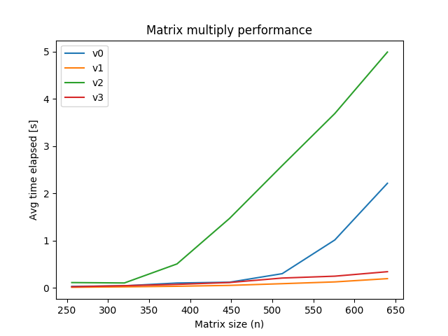

# Raport do zadań z pracowni #2

### Autor: Sławomir Górawski
### Numer indeksu: 288653

Konfiguracja
---

Informacje o systemie:

 * Dystrybucja: MacOSX 10.13.2
 * Kompilator: clang-902.0.39.2
 * Procesor: Intel(R) Core(TM) i5-3210M CPU @ 2.50GHz
 * Liczba rdzeni: 2

Pamięć podręczna:

 * L1d: 32 KiB
 * L2: 256 KiB
 * L3: 3MiB

Pamięć TLB:

 * L1d: 64 wpisy
 * L2: 512 wpisów

Informacje o pamięciach podręcznych uzyskano na podstawie wydruku programu `sysctl`.

Zadanie 1
---

Wykres przedstawiający pomiary czasu:

Q:
Czy uzyskane wyniki różnią się od tych uzyskanych na slajdzie?

A:
Uzyskane wyniki wydają się podobne do tych uzyskanych na slajdzie (tam nie uwzględniały wersji z kafelkowaniem).

Q:
Z czego wynika rozbieżność między wynikami dla poszczególnych wersji mnożenia macierzy?

A:
Rozbieżność między wynikami wynika z cache'owania macierzy. Jeżeli przy kolejnych iteracjach używamy wartości leżących pod podobnymi adresami, zwykle będą one się znajdowały w cache'u. Jeżeli używamy wartości pod oddalonymi od siebie adresami, nie wykorzystujemy potencjału pamięci podręcznej i dostępy do pamięci spowalniają działanie programu.

Q:
Jaki wpływ ma rozmiar kafelka na wydajność «multiply3»?

A:
Zwiększenie rozmiaru kafelka powoduje spadek wydajności. Wniosek: aby optymalizacja przyniosła oczekiwany skutek, cały kafelek musi mieścić się w cache'u.

Zadanie 3
---

Q:
Jaki wpływ na wydajność «transpose2» ma rozmiar kafelka?

A:
Wraz ze wzrostem rozmiaru kafelka wydajność maleje. Powód - analogiczny jak w zad. 1.

Q:
Czy czas wykonania programu z różnymi rozmiarami
macierzy identyfikuje rozmiary poszczególnych poziomów pamięci podręcznej?

A:
Tak. Można to wywnioskować.

Zadanie 4
---

Q:
Ile instrukcji maszynowych ma ciało pętli przed i po optymalizacji?

A:
Przed - 50, po - 54.

Q:
Ile spośród nich to instrukcje warunkowe?

A:
Przed - 9, po - 3.

Q:
Czy rozmiar tablicy ma duży wpływ na działanie programu?

A:
Praktycznie niezauważalny.

Zadanie 5
---

Q:
Czemu zmiana organizacji danych spowodowała przyspieszenie algorytmu wyszukiwania?

A:
Dzięki odpowiedniemu ułożeniu elementów w tablicy (jako pełne BST) przy każdym przeszukiwaniu z początku będziemy odwoływać się do elementów leżących w podobnych miejscach, tj. oddalając się powoli od lewego końca tablicy. Większość z tego obszaru zostanie zcache'owana, co przyspieszy kolejne wyszukiwania. Zwykły binsearch skacze po tablicy w sposób trudny do przewidzenia, przez co nie możemy liczyć jej cache'owanie.

Q:
Czy odpowiednie ułożenie instrukcji w ciele «heap_search» poprawia wydajność wyszukań?

A:
Tak. Odwołując się do jej wersji z poprzedniej listy 12, usunięcie jednej z instrukcji warunkowych i zastąpienie jej operacjami bitowymi znacznie przyspieszyło działanie `heap_search`.
